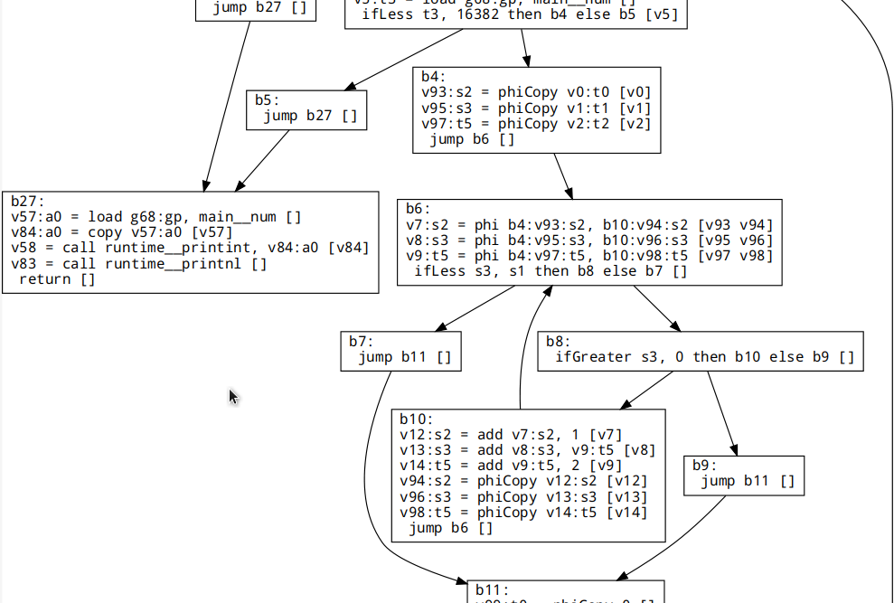
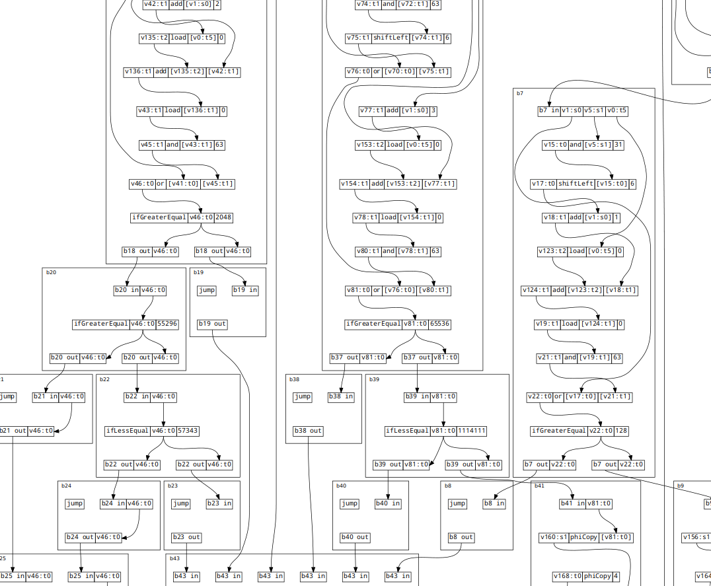

# NanoGo

`NanoGo` is a Go (golang) compiler for homebrew / hobby CPUs.

## Status

Note: this is a work in progress! Currently the following should work:

- built in `print()` and `println()`
- word-sized operations (`int` and `uint`)
- string literals and iterating over strings
- memory mapped I/O using `unsafe`
- extern funcs with assembly snippets (useful if you have I/O instructions)

Also, only [rj32](https://github.com/rj45/rj32) and [A32](https://github.com/Artentus/a32emu) are supported, but if you would like assistance adding your CPU, open an issue.
## What is it?

This compiler will take a Go package, read in all the packages it depends on in the usual way Go programs work, and compile all the code down into assembler in a style that is compatible with [customasm](https://github.com/hlorenzi/customasm).

As of this writing, customasm does not support linking, so a single large assembly file is produced. A "CPU Def" file can be included which configures the assembly language, as well as the memory layout with `#bank`s.

## Why Go?

C is great, but the language is not the easiest to parse, and while there's many great projects like [LCC](https://github.com/drh/lcc), they are not the easiest to work on and modify for a homebrew CPU.

Go is a very simple language, and is very fast to learn, yet powerful enough to be very productive.

As well, Go has a parser and type checker right in the the standard library. Further, there's an excellent [SSA library](https://golang.org/x/tools/go/ssa) that does most of the work of the frontend of a compiler. So all that's really required is a simple backend, which is what NanoGo is.

## Installing

Install [Go](https://golang.org/) for your system, then:

```sh
go get -u github.com/rj45/nanogo
```

You will also want to install [customasm](https://github.com/hlorenzi/customasm).

You may also want to install [emurj](https://github.com/rj45/rj32/emurj) if you want to be able to run programs in an `rj32` emulator.

## Running

You can run NanoGo to produce assembly like so:

```sh
nanogo -o output.asm asm testdata/seive/seive.go
```

If you have [customasm](https://github.com/hlorenzi/customasm) installed, then you can get a binary or hex file (depending on the architecture) like so:

```sh
nanogo -o output.hex build testdata/seive/seive.go
```

If you have [emurj](https://github.com/rj45/rj32/emurj) installed, you can build and run the program like so:

```sh
nanogo run testdata/seive/seive.go
```

If you'd like to inspect, say, what phases the compiler goes through and all the transformations it does, say, on the `main.main()` function of the above code, you can produce an `ssa.html` using a modified version of the code Go uses for its compiler:

```sh
nanogo -dump main__main asm testdata/seive/seive.go
```

And then you can open `ssa.html` in your browser.


There is also a way to generate various `.dot` graphs of the flow of values through the program using this:

```sh
nanogo -dump main__main asm testdata/seive/seive.go
```

You can look at the control flow graph at the time of register allocation:



Or an exploded view of the flow of values through the program (at register allocation):



A `.dot` viewer like `xdot` is recommended because it will highlight which line goes where and allow you to zoom in.

## Limitations

Keep in mind that it took a team of people many years to build the Go compiler and make it as good as it is. There is a lot of work to do to come close to that.

So, while all of Go is parsed, currently many parts of Go are simply not implemented and will result in obscure errors if you try to use them. In the future, a consistent way to track where errors come from and better documentation for them may make this easier.

Defer is ignored, though it could be implemented in the future. There's no allocation yet, nor any freeing of memory. Recovering from panics will not be implemented. Runtime type reflection is not yet implemented. Maps are not yet implemented. Interfaces are similarly not there, nor slices. Global arrays do work however.

`int`s, `uint`s, `byte`s, `rune`s and pointers are 16-bits for rj32. But non-standard sizes can violate some assumptions in the standard library, so anything relying on those assumptions will have bugs.

Almost none of the standard library is supported. You can try it and see if it will work, but some fundamental assumptions are violated, as well as many features relied on are missing. This compiler is meant to help you write your own standard library, kernel, OS and other software for your own homebrew CPU, so you could see the lack of a standard library as a feature.

## Design

NanoGo uses the [golang.org/x/tools/go/ssa](https://golang.org/x/tools/go/ssa) package to build and parse Go into [SSA form](https://en.wikipedia.org/wiki/Static_single_assignment_form).

This IR is then [converted](./parser) into a different [IR](./ir) which is [easier to work with](https://www.hpl.hp.com/techreports/Compaq-DEC/WRL-2000-2.html) and [transform](./xform).

After transformation there is a [SSA based tree register allocator](./regalloc) which uses the properties of SSA to [allocate registers in linear time](https://compilers.cs.uni-saarland.de/projects/ssara/).

After a final transformation pass, then finally [assembly code is generated](./codegen) and output.

## Retargeting / Porting to Your CPU

Some effort was put in to make this easy. See [the retargeting documentation](docs/retargeting.md).

## Contributing

Contributions are welcome!

Please open an issue if you intend to submit a PR if you want to make sure the contribution would be welcome beforehand. This is optional, but recommended if you're going to spend more than a few hours on it.

For PRs, please at least describe the purpose of the PR, and a brief explanation of what changes you made and why. Why is quite important, and will serve as documentation for others.

Contributions of your own architecture are welcome, but please ensure you have a working customasm cpudef and a publicly accessible emulator with install instructions. Other documentation on how your architecture works is also quite useful for those maintaining it as features are added.

Please be kind to one another and put effort into determining a kind way to share criticism.

## Forking, commercial use and permission

If you want to fork this project or use it commercially you do not need my permission nor do you need to inform me. But if you feel like letting me know, I would appreciate it, and you can do so via opening an issue.

If you do fork this project, all I ask is that the LICENSE file be kept intact and that your own copyright line be added to it. It's also polite to change the name if the fork should be made public.

## License

Copyright (c) 2021 rj45 ([github.com/rj45](https://github.com/rj45))

Licensed under the MIT License (MIT), see [LICENSE](./LICENSE).

Some parts Copyrighted by the Go Authors, under a BSD like license, see [Go's LICENSE](https://github.com/golang/go/blob/666fc173c02ff3004ac9ef867aa4eec7e243dde3/LICENSE).

Some parts Copyrighted by the TinyGo Authors, under a BSD like license, see [TinyGo's LICENSE](./LICENSE.tinygo).
